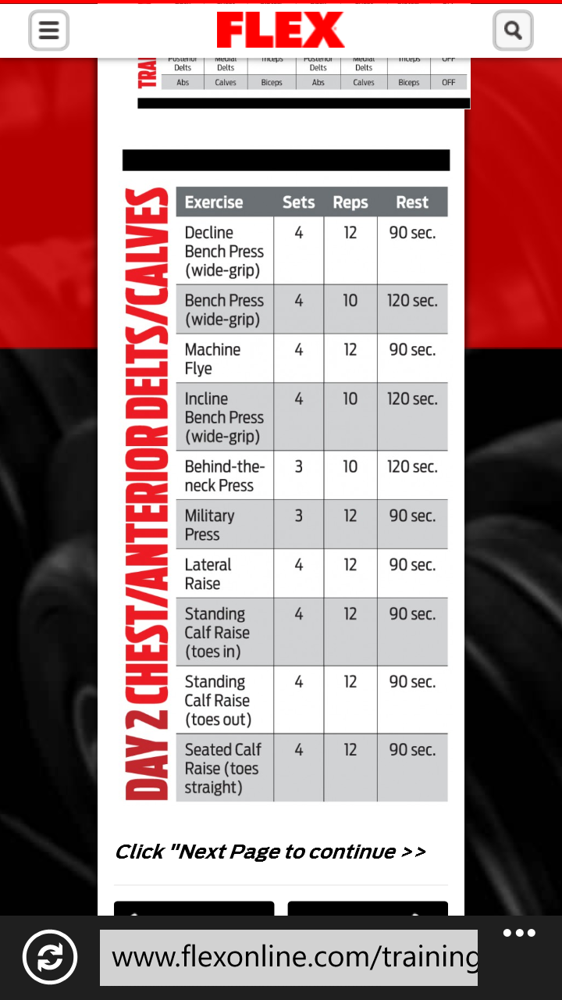
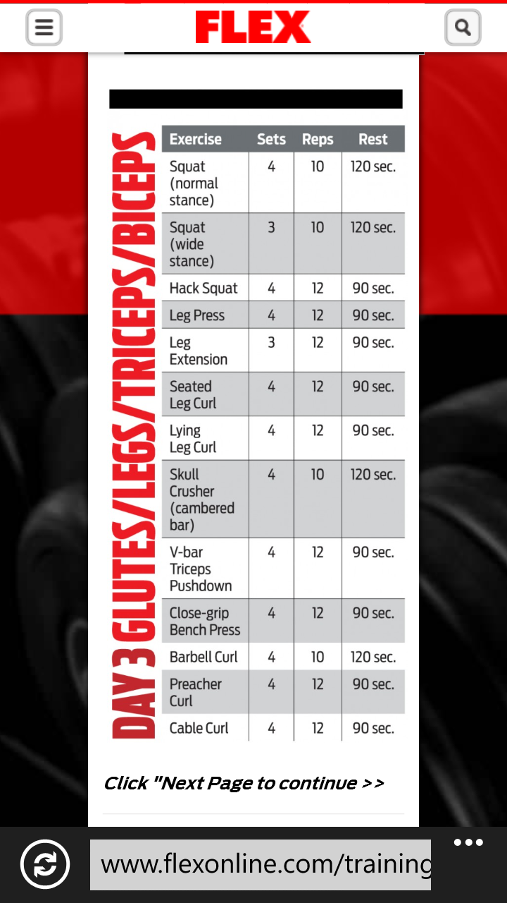
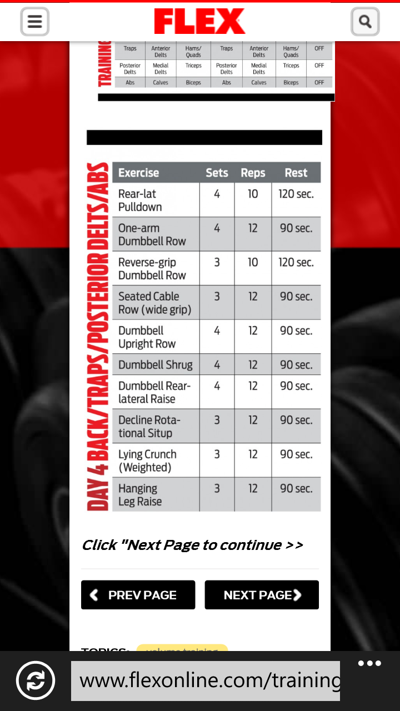

# 💪 About Fitness – Gym Management System


Welcome to **About Fitness**, a premium and feature-rich Gym Management System. This project is built to streamline gym operations, member administration, attendance logging, and invoicing.

It is available in two modes:
1. **Dynamic PHP Application**: Full backend experience powered by Apache, PHP, and MySQL.
2. **Static Interactive Demo**: Hosted live on GitHub Pages with state simulated via browser `localStorage`.

---

## 🚀 Live Demo (GitHub Pages)

Experience the frontend and admin capabilities instantly without any local database setup:
👉 **[Launch Live Demo](https://vijaymahes9080.github.io/Gym-Management-System-Project_php/)**

> 💡 **Demo Credentials:**
> - **Admin Access:** Login with Email `admin@gym.com` and any password to access the full admin dashboard.
> - **Member Access:** Login with Email `jack@gym.com` (or register a new user) to view member profile, daily routines, and attendance.

---

## ✨ Key Features

### 👤 Member Portal
- **Interactive Dashboard**: View current subscription plans and billing status.
- **Workouts Planner**: Build, view, and organize custom workout routines day-by-day.
- **Attendance Rate**: Track monthly attendance percentage through visual progress bars.
- **Profile Customization**: Edit profile details and update email records instantly.

### 🛡️ Admin Dashboard
- **Member Directory**: Full CRUD (Create, Read, Update, Delete) management for gym memberships.
- **Attendance Registry**: Mark users present or absent to dynamically calculate attendance logs.
- **Billing & Invoice Generator**: Process subscription payments and instantly generate downloadable invoice receipts.


---

## 📸 Gallery & Features

| 🏃‍♂️ Cardio Center | 💪 Strength Training | 🧘‍♀️ Aerobics |
| :---: | :---: | :---: |
|  |  |  |

## 📱 App Screenshots

<p align="center">
  
  
  
</p>

---

## 🛠️ Technology Stack

- **Backend Logic**: PHP (with MySQLi database drivers)
- **Database**: MySQL (relational table structure)
- **Design & Layout**: HTML5, Twitter Bootstrap, CSS3 (Vanilla Main Stylesheet)
- **Interactivity**: jQuery & AJAX, custom `localStorage`-based static database engine for GitHub Pages

---

## ⚙️ Installation & Setup (Local PHP Hosting)

Follow these steps to run the dynamic PHP/MySQL application locally:

### Prerequisites
- Install a local server environment (e.g., **XAMPP**, **WAMP**, or **MAMP**).

### Step 1: Clone the Repository
```bash
git clone https://github.com/vijaymahes9080/Gym-Management-System-Project_php.git
```
Move the folder into your local server root directory (e.g., `C:/xampp/htdocs/`).

### Step 2: Set Up Database
1. Start Apache and MySQL services in the XAMPP Control Panel.
2. Open your web browser and navigate to `http://localhost/phpmyadmin/`.
3. Create a new database named `gym`.
4. Select the `gym` database, go to the **Import** tab, choose the file [table.sql](file:///d:/BACKUP/projects/PHP%20project/Gym-Management-System-Project-in-PHP/table.sql), and click **Go**.

### Step 3: Configure Database Credentials
Modify database configuration parameters in [include/db_connect.php](file:///d:/BACKUP/projects/PHP%20project/Gym-Management-System-Project-in-PHP/include/db_connect.php) and [include/psl-config.php](file:///d:/BACKUP/projects/PHP%20project/Gym-Management-System-Project-in-PHP/include/psl-config.php) to match your local database settings (Host, Username, Password, Database name).

### Step 4: Run the Application
Open your browser and head to:
`http://localhost/Gym-Management-System-Project-in-PHP/`

---

## 📁 Repository Structure
```
├── docs/                 # Static interactive version for GitHub Pages
│   ├── index.html        # Landing page
│   ├── admin.html        # Simulated Admin dashboard
│   ├── profile.html      # Member profiles
│   └── boot/js/          # Static local database controller
├── include/              # PHP server connect & authentication scripts
├── admin/                # PHP Admin panel & PDF generation modules
├── profile/              # PHP User profile dashboards
├── boot/                 # Shared styling libraries (Bootstrap, main CSS)
├── table.sql             # SQL database schema
└── README.md             # Project documentation
```

---

## 📄 License
This project is open-source software licensed under the **GNU General Public License (GPL) Version 2**. See the [LICENSE](file:///d:/BACKUP/projects/PHP%20project/Gym-Management-System-Project-in-PHP/LICENSE) file for details.

---

**Developed by [Vijay Mahes](https://github.com/vijaymahes9080)**.
